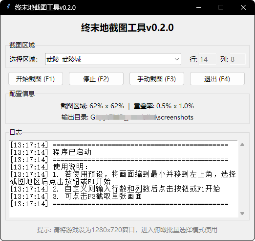
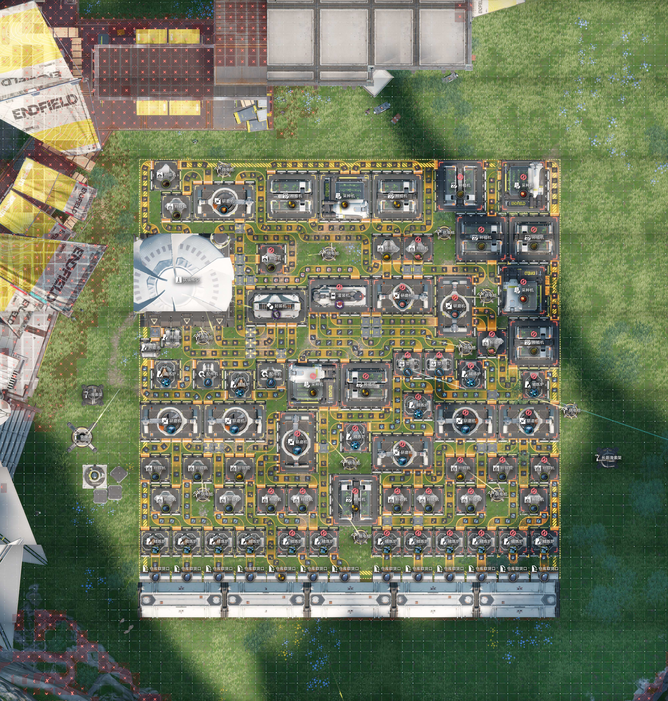
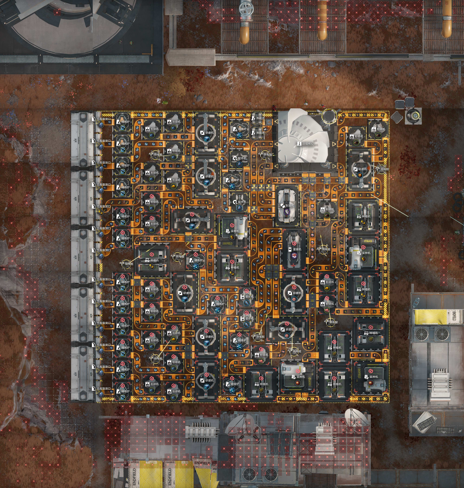
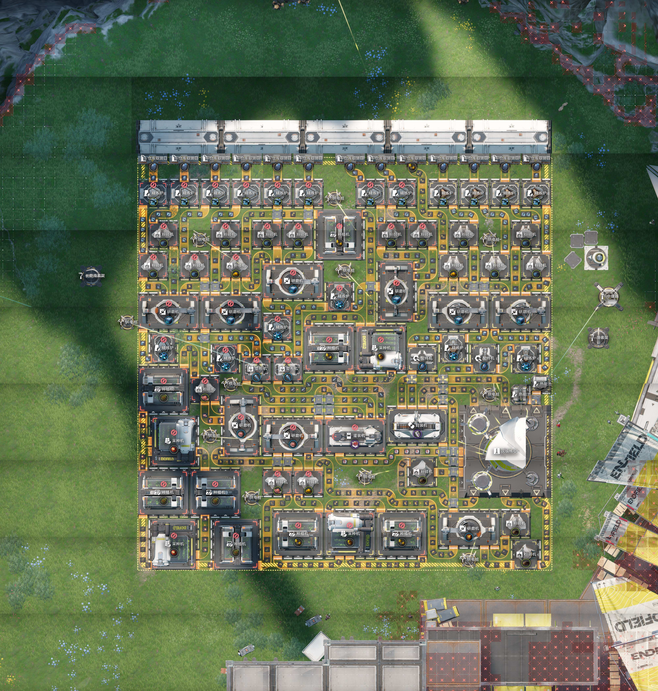

# 终末地俯瞰模式截图工具

一个用于《明日方舟：终末地》的自动截图和拼接工具，可以在俯瞰模式下自动捕捉游戏画面并拼接成完整的蓝图。

**当前版本：v2.0.0**

## 功能特点

- 提供图形界面，支持自定义拖拽距离、重叠率、截图区域等参数
- 支持 16:9 分辨率及自定义模式控制截图变量
- 提供三种截图结果：全名最小字、全名最大字、单字最小字
- 自动识别游戏窗口后网格化截图，支持6个预设区域及自定义行列数
- 蛇形遍历路径，自动处理重叠区域拼接，自动保存拼接后的结果
- 支持输出格式选择（PNG/JPG）
- 提供随机延迟模拟和快捷键控制

## 界面预览



## 效果展示

| 武陵城 | 景玉谷 | 枢纽区 |
|:---:|:---:|:---:|
|  |  |  |

| 谷地通道 | 供能高地 | 源石研究园 |
|:---:|:---:|:---:|
|  |  |  |

## 环境要求

- Python 3.8+
- Windows 操作系统

## 安装依赖

```bash
pip install pyautogui pygetwindow pillow keyboard
```

## 使用方法

### 方式一：直接运行 exe（推荐）

在 `Releases` 下载最新版本 exe，保存本地运行即可。

### 方式二：从源码运行

```bash
python auto_screenshot.py
```

### 准备工作

1. 打开《明日方舟：终末地》游戏，设置为 **16:9** 的任意分辨率
2. 选择需要的输出结果（全名最小字/全名最大字/单字最小字）
3. 进入俯瞰模式的批量选择状态
4. 若使用预设区域截图，须将画面缩至最小后，将画面移动到**最左上角**

### 快捷键

| 热键   | 功能           |
| ------ | -------------- |
| `F1`   | 开始自动截图   |
| `F2`   | 停止截图       |
| `F3`   | 手动截图一次   |
| `F4`   | 退出程序       |

### 选择截图区域

在界面下拉框中选择预设区域，或选择"自定义"后手动输入行列数。

**预设区域列表：**
- 武陵-武陵城
- 武陵-景玉谷
- 谷地-枢纽区
- 谷地-供能高地
- 谷地-谷地通道
- 谷地-源石研究园

## 工作原理

1. **窗口识别**：自动查找标题包含 "Endfield" 的窗口
2. **滚轮调整**：根模式自动调整画面缩放级别（全名最小字跳过此步骤）
3. **蛇形遍历**：从左上角开始，按行蛇形移动相机（左→右，下一行右→左）
4. **相机控制**：通过模拟鼠标中键拖拽移动游戏视角
5. **图片拼接**：根据设定的重叠率自动拼接所有截图

## 配置说明

程序默认配置位于 `CONFIG` 字典：

| 参数                | 默认值                    | 说明                           |
| ------------------- | ------------------------- | ------------------------------ |
| `stabilize_delay`   | 0.05秒                    | 拖拽后等待画面稳定的时间       |
| `screenshot_delay`  | 0.01秒                    | 截图前的等待时间               |
| `capture_region_x`  | 0.626                     | 截图区域水平比例（相对窗口宽度）|
| `capture_region_y`  | 0.648                     | 截图区域垂直比例（相对窗口高度）|
| `capture_offset_y`  | 0.03                      | 截图区域垂直偏移（正数向下）   |
| `drag_margin`       | 2像素                     | 拖拽操作距离窗口边缘的距离     |
| `drag_duration`     | 0.01秒                    | 拖拽动作持续时间               |
| `base_window_size`  | (1600, 900)               | 基准窗口尺寸（宽, 高）         |
| `output_folder`     | `screenshots/`            | 截图输出目录                   |
| `output_format`     | JPG                       | 输出格式（PNG或JPG）           |

> 所有时间参数均带有 ±10% 的随机波动模拟人工

区域配置（`REGION_CONFIG`）包含每个区域在不同滚动模式下的：
- `grid`: 网格大小 (行×列)
- `overlap_x/y`: 水平/垂直拼接重叠率
- `drag`: 拖拽距离 (像素)

## 输出

截图保存在 `screenshots/` 目录：

| 类型       | 文件名格式                             |
| ---------- | -------------------------------------- |
| 自动拼接   | `stitched_YYYYMMDD_HHMMSS.jpg`         |
| 自动拼接   | `stitched_YYYYMMDD_HHMMSS_模式.jpg`    |
| 手动截图   | `manual_YYYYMMDD_HHMMSS.jpg`           |

## 注意事项

1. 程序自动获取管理员权限用于模拟鼠标操作，需确认 UAC 提示
2. 截图过程中请勿移动游戏窗口及鼠标，确保游戏窗口处于前台且未被遮挡
3. 自定义模式下可配置拖拽距离、重叠率、截图区域比例等参数

## 打包说明

使用 PyInstaller 打包为独立 exe：

```bash
pyinstaller 终末地截图工具.spec --clean --noconfirm
```

## 技术栈

- **tkinter** - 图形用户界面
- **pyautogui** - 屏幕截图、鼠标操作
- **pygetwindow** - 游戏窗口管理
- **Pillow** - 图片拼接处理
- **keyboard** - 全局热键监听
- **PyInstaller** - 打包为独立可执行文件

## 许可证

本项目采用 [MIT License](LICENSE) 开源协议。
